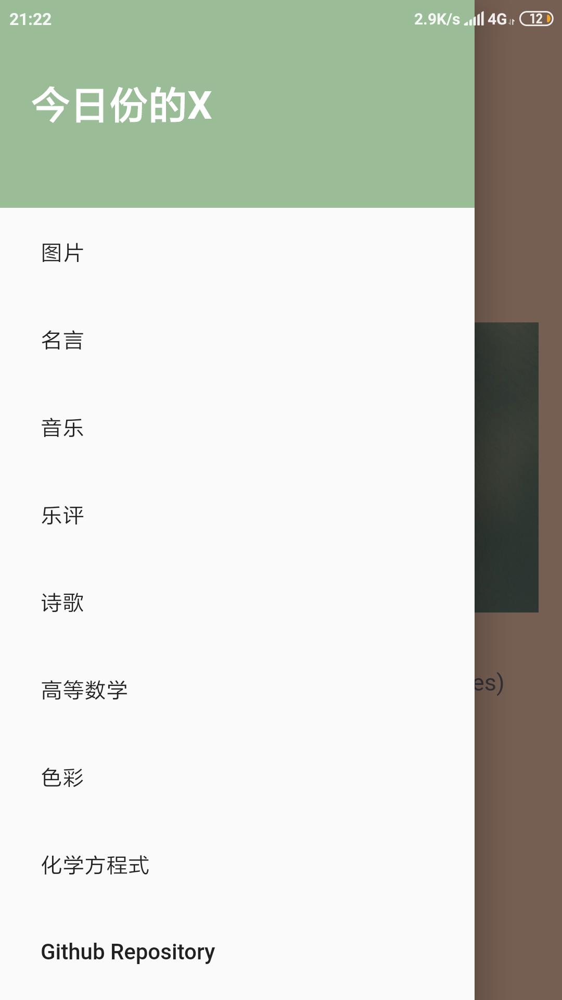
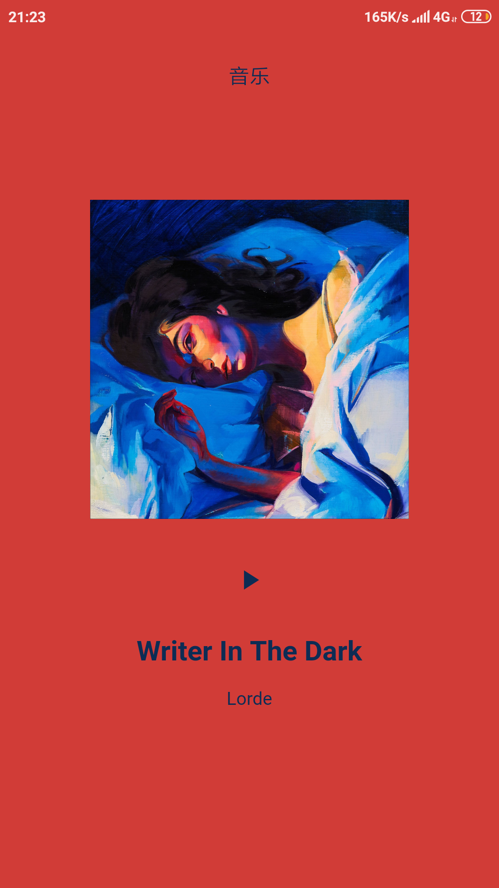
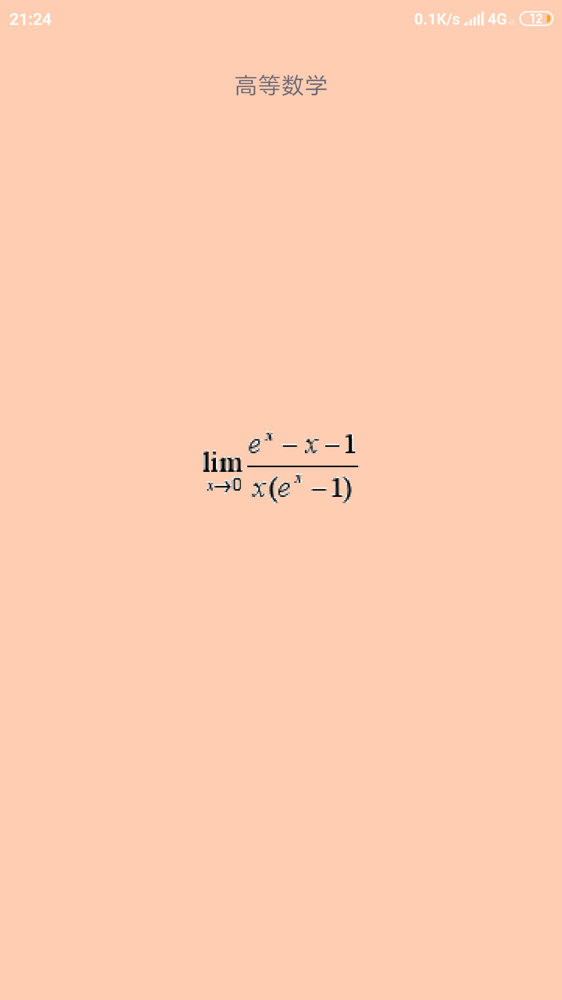
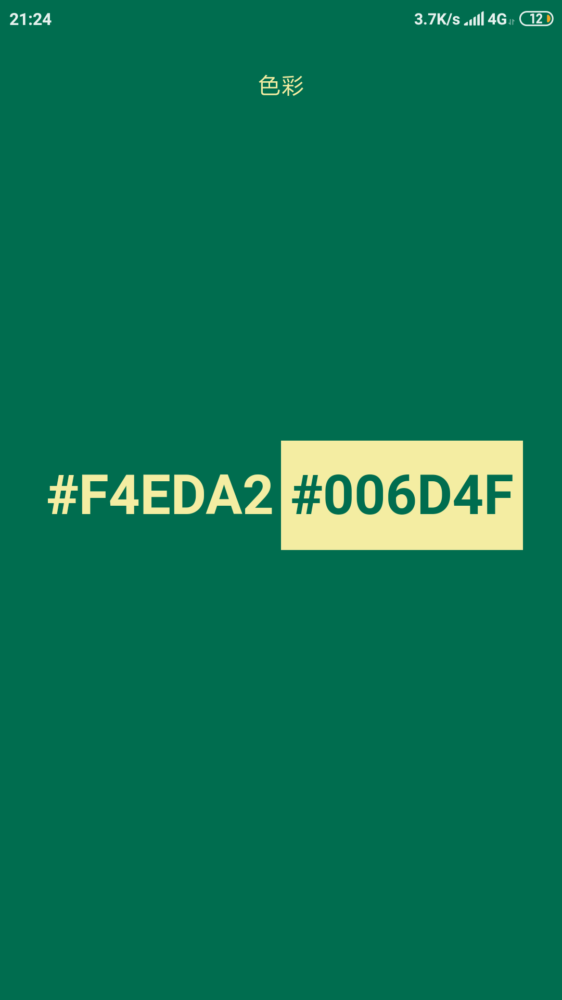

# 今日份的X

> 这是一个`Flutter`写的**一个无聊的App**
>
> **每天推荐一个不同的：图片、诗歌、名言、音乐、乐评、高等数学、两种配色、化学方程式、Github Repo、知乎问题、文章。**
>
> （P.S. 除图片来自Bing首页，每天仅有一张外，其他页面支持下拉刷新来更新内容）

**[下载APK](https://github.com/shuiRong/TodayX/releases)**


#### 效果预览

------

|   |   |   |
| --------------------------- | --------------------------- | --------------------------- |
|   |   |   |
|   |   |   |
|  |  |  |


> **Flutter初试感受**：去玩`Swift`了 :p 

#### 如何运行：

---

首先确保你本地有 Flutter 项目所需环境，官方文档 [英文教程](https://flutter.dev/docs/get-started/install) [中文文档](https://flutter-io.cn/docs)

**下载项目：**

```bash
git clone https://github.com/shuiRong/TodayX
cd ./TodayX
```


运行项目前需要通过 USB 将手机连接到电脑上或者启动模拟器，遵循官方教程即可。

然后**运行项目**：

（如果你使用 Visual Studio Code 来开发，也可以不通过下述命令行，而是通过全程通过VSC来操作：请参看[第2、3小节](https://flutter-io.cn/docs/get-started/editor?tab=vscode)）

```bash
// 安装项目依赖
flutter packages get
// 运行项目
flutter run
```


#### 项目中用到的第三方数据

---

感谢作者


* 诗歌：`https://api.gushi.ci/all.json`

  ```bash
  // 20190526231929
  {
    "content": "墉集欺猫鼠，林藏逐雀鹯。",
    "origin": "中秋咏怀借杜子美秋日述怀一百韵和寄柳州假鸣桑先生",
    "author": "徐威",
    "category": "古诗文-动物-写猫"
  }
  ```

* 名言：`https://v1.hitokoto.cn/`

  ```bash
  // 20190526232311
  {
    "id": 14,
    "hitokoto": "用你的笑容去改变这个世界，别让这个世界改变了你的笑容。",
    "type": "a",
    "from": "网络",
    "creator": "酱七",
    "created_at": "1468605909"
  }
  ```

* Bing首页图：`https://cn.bing.com/HPImageArchive.aspx?format=js&idx=0&n=1`

  ```bash
  // 20190526232348
  {
    "images": [
      {
        "startdate": "20190525",
        "fullstartdate": "201905251600",
        "enddate": "20190526",
        "url": "/th?id=OHR.MarathonduMont_ZH-CN5049722437_1920x1080.jpg&rf=LaDigue_1920x1080.jpg&pid=hp",
        "urlbase": "/th?id=OHR.MarathonduMont_ZH-CN5049722437",
        "copyright": "圣米歇尔山 (© Leroy Francis/Getty Images)",
        "copyrightlink": "http://www.bing.com/search?q=%E5%9C%A3%E7%B1%B3%E6%AD%87%E5%B0%94%E5%B1%B1&form=hpcapt&mkt=zh-cn",
        "title": "",
        "quiz": "/search?q=Bing+homepage+quiz&filters=WQOskey:%22HPQuiz_20190525_MarathonduMont%22&FORM=HPQUIZ",
        "wp": true,
        "hsh": "02a3db999f76ec114c45de97cecc30ac",
        "drk": 1,
        "top": 1,
        "bot": 1,
        "hs": [
        ]
      }
    ],
    "tooltips": {
      "loading": "正在加载...",
      "previous": "上一个图像",
      "next": "下一个图像",
      "walle": "此图片不能下载用作壁纸。",
      "walls": "下载今日美图。仅限用作桌面壁纸。"
    }
  }
  ```

* 音乐：`https://music.aityp.com/playlist/detail?id=145787433`

  ```
  // 详细接口文档见：https://binaryify.github.io/NeteaseCloudMusicApi
  内容过多不便展示
  ```

* 网易云评论：`https://api.comments.hk/`

  ```bash
  // 20190526232507
  {
    "song_id": 480426313,
    "title": "There For You",
    "images": "https://p2.music.126.net/E_ffmvXrVZoTugVf_Zf4Cg==/18520173860179248.jpg",
    "author": "Martin Garrix",
    "album": "There For You",
    "description": "歌手：Martin Garrix。所属专辑：There For You。",
    "mp3_url": "https://api.comments.hk/music/480426313",
    "pub_date": "2017-05-25 16:00:00",
    "comment_id": 393094070,
    "comment_user_id": 267009137,
    "comment_nickname": "我不吃鱼肉",
    "comment_avatar_url": "https://p1.music.126.net/HC5zku5foEI_rIP9YShyoQ==/109951164014518098.jpg",
    "comment_liked_count": 25271,
    "comment_content": "恭喜\"小马戳\"组合的新单出世!!好期待他们的下一次合作 也希望马丁不要弯不要弯不要弯啊哈哈哈哈哈哈[爱心][爱心][爱心][爱心]",
    "comment_pub_date": "2017-05-25 16:01:38"
  }
  ```

* 随机配色：`https://randoma11y.com/stats`

  ```
  内容过多不便展示
  ```

* Github Trending：`https://github-trending-api.now.sh/repositories`

  ```
  内容过多不便展示
  ```

* 知乎日报：`https://news-at.zhihu.com/api/4/news/latest`

  ```bash
  // 20190526232635
  {
    "date": "20190526",
    "stories": [
      {
        "images": [
          "https://pic2.zhimg.com/v2-58b5abf70967054a9a057d4f1da8f811.jpg"
        ],
        "type": 0,
        "id": 9711762,
        "ga_prefix": "052622",
        "title": "小事 · 你会付出多少去挽救父母的生命？"
      }
   	...
    ],
    "top_stories": [
      {
        "image": "https://pic2.zhimg.com/v2-0dc73b026624fc19637c5cb25ff679a9.jpg",
        "type": 0,
        "id": 9711735,
        "ga_prefix": "052507",
        "title": "为什么牛奶卖不完，宁可倒掉也不免费送人？"
      }
      ...
    ]
  }
  ```

* 历史上的今天：`https://api.ooopn.com/history/api.php?type=json`

  ```bash
  // 20190526232721
  {
    "code": "200",
    "day": "2019年05月26日",
    "content": [
      "刘宋顺帝刘准让帝位于萧道成",
      "爱德华波特亚历山大出生",
      "第一次鸦片战争英军首次进攻广州城",
      "清朝将领和春逝世",
      "英国兼英属自治领皇后玛丽皇后出生",
      "美国记者查尔斯道创造的股票指数道琼斯指数首次发布",
      "俄国沙皇尼古拉二世在圣彼得堡登基",
      "美国影星约翰韦恩出生",
      "曼联足球俱乐部主帅马特巴斯比出生",
      "美国记者雅各布里斯逝世",
      "日本军将领白川义则逝世",
      "中国首次成功发射地对地中程导弹",
      "日本漫画家和月伸宏出生",
      "德国哲学家马丁海德格尔逝世",
      "京剧艺术家孟小冬逝世"
    ]
  }
  ```
  
* 每日一文：`https://interface.meiriyiwen.com/article/today?dev=1`

  ```json
  {
    "data": {
      "date": {
        "curr": "20170217",
        "prev": "20170216",
        "next": "20170218"
      },
      "author": "契诃夫",
      "title": "散戏之后",
      "digest": "娜卡.戴莱尼同她母亲从戏园里回来，那天，戏园里演了一出戏名叫《叶甫盖尼.奥涅金》的戏剧。她跑到自己的屋子里去，很快脱去衣服，散开发辫，穿了一",
      "content": "<p>娜卡.戴莱尼同她母亲从戏园里回来，那天，戏园里演了一出戏名叫《叶甫盖尼.奥涅金》的戏剧。她跑到自己的屋子里去，很快脱去衣服，散开发辫，穿了一条短裙和衬衣，坐在桌子旁边，想仿照达吉雅娜的笔调写一封信。</p><p>她写道——</p><p>“我爱你，可是你不爱我，不爱我！”</p><p>她写着写着就笑了起来。</p><p>她那时候不过十六岁，她还没有爱上谁，却知道军官戈尔南和学生格罗兹杰夫都很爱她。可自从那天晚上看完戏以后，她对于他们的爱情忽然生出疑惑。做不被人爱的、不幸的人——那多有趣啊！她觉得一个人爱得深，而另一个却很冷淡，是一件很有意思，很动人，并且含着诗味的事情。</p><p>在那出戏里，奥涅金以绝不爱人为乐趣，达吉雅娜却老迷着他，因为她很爱他，假如他们能够互相恋爱，享受幸福，那这件事情也就枯涩无味了。</p><p>娜卡想起军官戈尔南来，就往下写道：</p><p>“你也不用在我面前坚持说你爱我，我也不能够信你。你很聪明，很有学问，很严正；你是绝对的天才，光明的未来正等着你，我却是一个低微的不幸女人，并且你也深知我只会成为你生活上的阻碍。虽然你还在注意我，想着用你自己的理想来迎合我，然而这一定是错误的，现在你一定已经后悔，并且自问道：我为什么要同那姑娘亲热呢？可不过因为你这个人太善良，所以你还不愿意承认呢！……”</p><p>娜卡写到这里，觉得自己身世飘零，禁不住就流下泪来，继续写道：</p><p>“我很不忍离开我那亲爱的母亲和兄弟，要不然我就披上袈裟，只身遁去，到那人迹不到的地方去另讨生活。那你也就成了自由的人，可以另爱别人了。唉，我还不如一死呢！”</p><p>娜卡含着一泡眼泪，也辨别不出写的是什么，只看见桌子上，地板上和顶棚上，一条一条的彩虹不住地在那里摇荡着，仿佛是从三棱镜里看见的一样。她也写不上来，就往椅子背上一靠，想起戈尔南来。</p><p>男子真有趣，却真能撩人呀！娜卡想起他们一块儿谈论音乐的时候，他那又温柔，又口吃，并且时常错误的言辞是何等的有趣！他也总是竭力地使自己的嗓音不流露出激烈的声调。在社交场合，即使有冷静的头脑和骄傲的习气，受过高等教育，有着道德高尚的表征，自己的嗜好也不得不收藏在一边。戈尔南也知道这样藏着，可是终有时要流露出来，所以大家都知道他对于音乐十分嗜好。有人不免要不断地议论音乐，或者有不了解音乐的人偏要发出那可笑的言论，他却还保持着常态，好像恐惧胆小似的一句话也不说。他钢琴弹得很好，和真正的钢琴家弹的一样。假如他不做军官，他一定会成为一位有名的音乐家呢。</p><p>眼睛里的泪也干了。娜卡回忆起戈尔南曾在音乐会上和她讲过爱情，后来在穿衣架旁边也讲过一次，那时候正徐徐地吹着微风，她又往下继续写道：</p><p>“我很高兴你跟格罗兹杰夫认识了，他是一个很聪明的人，你一定也爱他，昨天他在我家里，坐到两点钟才走。那天晚上我们都很快乐，可惜你却没有来。他讲了许多有趣的话。”</p><p>娜卡手按在桌上，头枕着手，她的头发遮没了那封信。她记得学生格罗兹杰夫也很爱她，他也应当有一封和戈尔南同样的信才好。不过要怎样给格罗兹杰夫写信呢？不知什么缘故她的胸中忽然掀起了一股的欢乐：起初这股欢乐还小，仿佛在胸问摇荡着一个小橡皮球儿一样，然后那快乐就慢慢地扩大，竟像波浪起伏一样。娜卡也忘记想戈尔南和格罗兹杰夫，因为她的思想已经错乱，可是那快乐却越发地增长起来，从胸脯达到手足四肢，欢乐好像轻微的冷风似的吹进头脑里来，掠着头发过去。她耸着肩膀不住地微笑，连桌子和灯上的玻璃都慢慢地颤动起来，眼泪也进了出来，落在那张信纸上面。她的笑好久没能止住，她想要停止来着。为了表明自己不是无端发笑，她打算赶紧想出一件可笑的事情来。她觉得自己笑得快透不过气来了，赶紧说道：</p><p>“这只小狗真可笑！这只小狗真可笑！”</p><p>她记起，昨天喝茶后格罗兹杰夫同小狗马克新闹着玩，之后他就讲起一只聪明小狗的故事来：</p><p>那只小狗在院子里追赶乌鸦，乌鸦却回头看着它说道：</p><p>“哼，你这个坏蛋！”</p><p>小狗并不知道那被他追赶的乌鸦是很有学问的，一下子就呆住了，疑惑了好一会儿，然后就狂吠起来。</p><p>想到这里，娜卡决然道：“不，我还是爱格罗兹杰夫的好。”说完这话，她立刻把刚才那封信撕掉了。</p><p>她开始想着那学生的爱情和自己的爱情，可不料她脑筋里的念头总是摇摆不定。于是她就乱想起来：母亲、街市、铅笔、风琴……她想得很高兴，她认为世界上所有的东西都是好的，美妙的，并且她的欢乐还告诉她说这并不算稀奇，还有更好的在后面。很快春天过去，夏天到来，她就可以同母亲到戈尔比基去，戈尔南也告假往那里去，同她一块儿在花园里闲逛，顺便谈谈心事。格罗兹杰夫也跑来同她一起打棒球和网球，给她讲可笑或奇异的事情。他十分喜欢花园、黑夜、青天和繁星。她重新又耸着肩笑起来，她仿佛觉得室内一阵阵的花香从窗外透将进来，沁人人的心脾。</p><p>她走到她前，坐了下来，也不知道那使她沉溺的欢乐是从哪里来的，她目不转睛地瞧着挂在床背后面的神像，喃喃地说道：“上帝！上帝！上帝！”</p>",
      "wc": 1963
    }
  }
  ```
  > 解析：  
  >   
  > date：日期  
  > curr：今日日期，yyyyMMdd 格式  
  > prev：昨日日期，yyyyMMdd 格式  
  > next：明日日期，yyyyMMdd 格式  
  > author：作者  
  > title：标题  
  > digest：首段  
  > content：正文内容  
  > wc：???  
